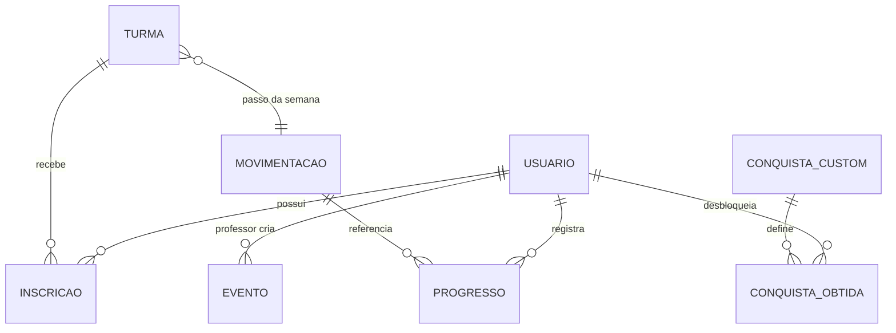

# DançaMais — Documentação do Sistema

Documento de referência para **apresentação**, **onboarding** e **discussão de novas funcionalidades**. Descreve o que o sistema faz hoje, como está organizado no código e quais são os principais fluxos de dados.

---

## 1. Visão geral

O **DançaMais** é um aplicativo móvel (Flutter) para escolas de dança. Conecta **alunos** e **professores** em torno de:

- **Turmas** (modalidade, nível, horários, passo da semana)
- **Biblioteca de movimentações** (passos e coreografias)
- **Progresso de aprendizado** com validação do professor
- **Gamificação** (XP, níveis, conquistas, ranking)
- **Calendário de eventos** da escola
- **Solicitações** (entrada em turma, aprovação de professor)

Não há servidor backend próprio: a persistência e a autenticação ficam no **Firebase** (Authentication + Cloud Firestore), em modelo **cliente-servidor** com backend gerenciado (BaaS).

---

## 2. Perfis de usuário

| Perfil | Acesso | Observações |
|--------|--------|-------------|
| **Aluno** | Dashboard, turmas, conquistas, ranking, perfil | Ganha XP e nível; marca progresso nos passos |
| **Professor** | Turmas, biblioteca, conquistas, perfil + home com agenda | Pode ser limitado às **modalidades** que leciona |
| **Professor admin** | Mesmas telas, sem restrição de modalidade | Campo `isAdmin: true` em `usuarios/{uid}` |
| **Professor pendente** | Tela de espera até aprovação | `status: pendente` no cadastro |
| **Professor recusado** | Pode solicitar novamente modalidades | `status: naoSolicitado` |

O roteamento após login é feito em `lib/ui/widgets/auth_wrapper.dart`, lendo `usuarios/{uid}` (`tipo`, `status`).

---

## 3. Arquitetura técnica

### 3.1 Stack

- **Flutter** (SDK `>=3.4.3`)
- **Firebase Core**, **Authentication**, **Cloud Firestore**, **App Check**
- **flutter_bloc** — usado principalmente na **autenticação** (`AuthBloc`)
- **google_fonts**, tema customizado em `lib/core/theme/app_theme.dart`

### 3.2 Organização em camadas (`lib/`)

| Pasta | Papel |
|-------|--------|
| `ui/screens/` | Telas principais (dashboards, turmas, ranking, perfil, login) |
| `ui/widgets/` | Componentes reutilizáveis (`auth_wrapper`, sheets de eventos, `tap_effect`) |
| `logic/auth_bloc/` | Login, cadastro, logout e estados de sessão |
| `logic/gamification/` | Regras de XP, progresso, conquistas automáticas |
| `data/services/` | `AuthService`, `PermissaoService` |
| `models/` | Modelos e parsing Firestore (`TurmaModel`, `MovimentacaoModel`, etc.) |
| `core/` | Tema e notificador de dark mode |

**Importante:** a arquitetura é **em camadas por organização**, mas **não é rigorosa em todo o app**. Autenticação e gamificação passam por serviços/BLoC; a maior parte das telas consulta o **Firestore diretamente** com `StreamBuilder` e `.snapshots()` para tempo real.

### 3.3 Fluxos de comunicação (resumo)

```
┌─────────────┐     login/cadastro      ┌──────────────┐     Auth API     ┌──────────────────┐
│  UI (telas) │ ───────────────────────►│  AuthBloc    │ ───────────────► │ Firebase Auth    │
└──────┬──────┘                         └──────┬───────┘                  └──────────────────┘
       │                                       │
       │ listagens, turmas, eventos…           │ usuarios no cadastro
       ▼                                       ▼
┌──────────────────────────────────────────────────────────────────────────┐
│                        Cloud Firestore                                    │
└──────────────────────────────────────────────────────────────────────────┘
       ▲
       │ marcar aprendido / validar / conquistas
       │
┌──────┴──────────────┐
│ GamificationService │
└─────────────────────┘
```

---

## 4. Navegação do aplicativo

Ambos os perfis usam um **dock flutuante** na parte inferior (home no centro, índice `2`).

### Aluno (`StudentDashboard`)

| Índice | Tela | Arquivo |
|--------|------|---------|
| 0 | Turmas | `student_classes_screen.dart` |
| 1 | Conquistas | `student_badges_screen.dart` |
| 2 | **Home** | trecho `_HomeScreen` em `student_dashboard.dart` |
| 3 | Ranking | `student_ranking_screen.dart` |
| 4 | Perfil | `student_profile_screen.dart` |

### Professor (`TeacherDashboard`)

| Índice | Tela | Arquivo |
|--------|------|---------|
| 0 | Turmas | `teacher_classes_screen.dart` |
| 1 | Biblioteca (passos / coreografias) | `teacher_steps_library_screen.dart` |
| 2 | **Home** | `_buildHomeScreen` em `teacher_dashboard.dart` |
| 3 | Conquistas | `teacher_badges_screen.dart` |
| 4 | Perfil | `teacher_profile_screen.dart` |

Telas auxiliares: `login_screen.dart`, `register_screen.dart`, `selection_screen.dart` (escolha de tipo no fluxo de entrada).

---

## 5. Funcionalidades por módulo

### 5.1 Autenticação e cadastro

- Login e registro com e-mail/senha (`AuthService` + `AuthBloc`).
- No cadastro, cria documento em `usuarios/{uid}` com `tipo` (`aluno` | `professor`).
- **Aluno:** entra ativo com `nivel: 1`, `xp: 0`, `conquistas: []`.
- **Professor:** entra com `status: pendente` até aprovação; modalidade(s) escolhida(s) no registro.

### 5.2 Home — Agenda do dia

**Aluno e professor** exibem uma agenda empilhada (cards com efeito de profundidade):

- **Aulas de hoje:** turmas com horário no dia da semana atual (`turmas` + `horariosDia`).
- **Eventos de hoje:** documentos em `eventos` com `dataHora` no dia.

Card principal (hero): modalidade ou tipo “Evento” + nome.  
Cards secundários: **nome da turma/evento** + **modalidade** (alinhado entre aluno e professor).

**Professor — home adicional:**

- Grid tipo “bento” com atalhos (turmas, biblioteca, solicitações, **eventos** via bottom sheet).
- **Solicitações:** hub para validar passo da semana dos alunos e aprovar pedidos de entrada em turma.

**Aluno — home adicional:**

- Cabeçalho com nome, nível, barra de XP.
- **Passo da semana** por turma inscrita (fluxo Visto → Praticado → Aprender → Aprendido/Validado).
- Últimas conquistas (toque abre detalhes).
- Link para **calendário de eventos** (bottom sheet, somente leitura).

### 5.3 Turmas

**Professor (`teacher_classes_screen.dart`):**

- CRUD de turmas (nome, modalidade, nível, horários por dia, papéis de aluno na turma).
- Definir **passo da semana** (`passoSemanaId`, `passoSemanaNome` na turma).
- Gerenciar alunos inscritos, solicitações pendentes, validação do progresso do passo da semana.
- Configuração de modalidades da escola em `escola/config` (admin).

**Aluno (`student_classes_screen.dart`):**

- Lista turmas via `inscricoes` + dados de `turmas`.
- Solicitar entrada em turma (`solicitacoes/pendentes`).
- Ver passo da semana e avançar progresso (mesmo fluxo de estágios da home).

### 5.4 Biblioteca de movimentações (professor)

`teacher_steps_library_screen.dart`:

- Abas **Passos** e **Coreografias** (`movimentacoes`, campo `tipo`).
- Filtro por modalidade (professor vê todas; edição só nas modalidades permitidas, salvo admin).
- Criar, editar, excluir, definir como passo da semana em uma turma.
- Contador **“alunos”** ao lado do card: quantidade em `progressoAluno` com status `aprendido` ou `validado` (tempo real).

### 5.5 Progresso do aluno

Documento: `progressoAluno/{alunoId}_{movimentacaoId}`

| Status | Significado |
|--------|-------------|
| `naoAprendido` | Registro inicial (“Visto”) |
| `emProgresso` | “Praticado” |
| `aprendido` | Aluno concluiu; **+50 XP** |
| `validado` | Professor confirmou; **+15 XP** bônus |

Transições principais em `GamificationService` e também em handlers nas telas de turma/home (com transações Firestore para XP e contador `totalAprenderam` em `movimentacoes`).

### 5.6 Gamificação — XP e níveis

- XP acumulado em `usuarios/{uid}.xp`; nível derivado por fórmula no serviço de gamificação.
- Barra de progresso na home do aluno mostra XP no nível atual vs. custo para subir.

### 5.7 Conquistas

**Catálogo:** `conquistasCustom/{id}` — criadas pelo professor.

**Tipos de gatilho automático** (`TipoGatilho` em `conquista_model.dart`):

| Gatilho | Exemplo |
|---------|---------|
| `passosAprendidos` | Aprendeu X movimentações no total |
| `nivelAtingido` | Atingiu nível X |
| `passosModalidade` | X movimentações em uma modalidade |
| `passosValidados` | X validações pelo professor |
| `frequenciaSemanas` | X semanas seguidas com aprendizado |
| `especial` | **Manual** — professor concede (chip “Manual” na lista do professor) |

Conquistas obtidas ficam no array `usuarios/{uid}.conquistas` e/ou subcoleção `usuarios/{uid}/conquistas` (o app faz merge em algumas telas).

**Professor:** criar, editar, excluir, **conceder** a um aluno de uma turma.  
**Aluno:** visualizar conquistas desbloqueadas e critérios do catálogo.

### 5.8 Ranking (aluno)

`student_ranking_screen.dart`:

- Abas **Geral** e **Por modalidade**.
- Ordenação: nível → XP → passos aprendidos → coreografias aprendidas → nome.
- Contagem de passos/coreos: consulta `progressoAluno` + tipo em `movimentacoes` (aprendido/validado).
- Atualização ao mudar progresso (listener invalida cache).

### 5.9 Eventos (calendário)

**Professor:** bottom sheet `teacher_events_sheet.dart`

- Modos **Lista** e **Meses**.
- Criar, editar, excluir eventos (`eventos`: nome, descrição, localização, `dataHora`, `criadoPorId`).
- Eventos passados: estilo visual diferenciado + selo “Encerrado”.
- Seletor de horário em **formato 24h**.

**Aluno:** bottom sheet `student_events_sheet.dart`

- Mesma estrutura de listagem/meses (somente leitura).
- Toque no card abre detalhes (data, horário, local, descrição).

Eventos do dia aparecem na **agenda** de aluno e professor.

### 5.10 Perfil

- Edição de dados pessoais, tema claro/escuro (`AppThemeNotifier`).
- Professor: modalidades, logout.
- Aluno: turmas inscritas, etc.

### 5.11 Permissões do professor

`PermissaoService` / `PerfilProfessor`:

- `isAdmin` → acesso total.
- Caso contrário, `modalidades` limita edição em turmas, biblioteca e algumas ações em conquistas.

---

## 6. Modelo de dados (Firestore)

### Coleções principais

| Coleção | Uso |
|---------|-----|
| `usuarios/{uid}` | Perfil, tipo, status (professor), XP, nível, conquistas, modalidades |
| `usuarios/{uid}/conquistas` | Conquistas obtidas (subcoleção, merge com array) |
| `turmas/{id}` | Turma, horários, passo da semana, professor, papéis |
| `inscricoes` | Vínculo aluno ↔ turma |
| `movimentacoes/{id}` | Passos e coreografias (catálogo) |
| `progressoAluno/{alunoId_movId}` | Progresso por movimentação |
| `conquistasCustom/{id}` | Definição de conquistas |
| `eventos/{id}` | Eventos da escola |
| `solicitacoes/pendentes` | Pedidos de entrada / fluxos de aprovação |
| `feedbacks/{id}` | Feedback ao validar (opcional) |
| `conteudoDaTurma` | Vínculo movimentação ↔ turma ao cadastrar na biblioteca |
| `escola/config` | Modalidades e configurações globais |

### IDs compostos

- Progresso: `{alunoId}_{movimentacaoId}`

---

## 7. Tempo real

O app usa amplamente **`StreamBuilder` + `.snapshots()`** no Firestore para:

- Agenda, turmas, biblioteca, ranking, eventos, perfil, solicitações.

Isso mantém listas e contadores sincronizados sem refresh manual.

---

## 8. Padrões de interface

- **Bottom sheets** para formulários, menus de opção, eventos e detalhes.
- **`TapEffect`** para feedback de toque.
- Cards brancos, cantos arredondados (~18–20px), sombra leve.
- Cores: `AppTheme.primary`, `secondary`, `third`, `detail`.
- Barrinha cinza no topo de sheets modais (padrão visual).

---

## 9. Diagrama simplificado do domínio



---

## 10. O que o sistema **não** faz hoje (limites atuais)

Útil para delimitar escopo em apresentações:

- Sem **push notifications** (FCM).
- Sem **upload de vídeo** (Firebase Storage não integrado).
- Sem **Cloud Functions** (regras de negócio críticas dependem do cliente).
- Sem **modo offline** estruturado.
- **Regras de segurança** Firestore devem estar configuradas no console (não versionadas neste repo como código de rules).
- Relatórios/exportação, pagamentos, chat e aulas ao vivo **não** estão no escopo atual.

---

## 11. Ideias para discussão (ponto de partida)

Use esta lista em reuniões de produto/TCC:

### Engajamento do aluno
- Notificações: passo da semana, evento amanhã, conquista desbloqueada.
- Metas semanais personalizadas por turma.
- Histórico visual de evolução (gráfico de XP / passos por mês).

### Professor e escola
- Dashboard analítico: alunos ativos, taxa de validação, modalidades mais praticadas.
- Aprovação de professor em painel web (hoje é fluxo no app + Firestore).
- Templates de conquistas por modalidade.

### Conteúdo
- Vídeo demonstrativo por passo (`videoUrl` já existe no model, sem player integrado).
- Coreografia: checklist de passos componentes com progresso parcial.

### Eventos
- Lembretes, recorrência (aula extra semanal), inscrição do aluno em evento.
- Exportar agenda (ICS).

### Técnico / qualidade
- Camada **repository** unificando Firestore (reduz duplicação e facilita testes).
- Cloud Functions para: conceder XP, validar conquistas, anti-fraude.
- Índices Firestore documentados no repositório.
- Testes automatizados de `GamificationService` e regras de ranking.

### Acessibilidade e UX
- Modo alto contraste, tamanho de fonte.
- Onboarding guiado no primeiro login.

---

## 12. Como rodar e onde mexer

```bash
flutter pub get
flutter run
```

| Quero alterar… | Onde começar |
|----------------|--------------|
| Login / cadastro | `auth_bloc/`, `auth_service.dart`, `login_screen.dart`, `register_screen.dart` |
| Regras de XP / conquista | `gamification_service.dart`, `conquista_model.dart` |
| Agenda / home | `student_dashboard.dart`, `teacher_dashboard.dart` |
| Turmas | `student_classes_screen.dart`, `teacher_classes_screen.dart` |
| Eventos | `student_events_sheet.dart`, `teacher_events_sheet.dart` |
| Ranking | `student_ranking_screen.dart` |
| Tema / cores | `lib/core/theme/app_theme.dart` |
| Permissões professor | `permissao_service.dart` |

Documentação técnica complementar (setup Firebase, dicas de debug): `README.md` na raiz do projeto.

---

## 13. Glossário rápido

| Termo | Significado no app |
|-------|-------------------|
| **Passo** | Movimentação isolada (`tipo: passo`) |
| **Coreografia** | Movimentação composta (`tipo: coreografia`) |
| **Passo da semana** | Movimentação em destaque na turma na semana atual |
| **Aprendido** | Aluno marcou conclusão (+50 XP) |
| **Validado** | Professor confirmou (+15 XP) |
| **Conquista especial** | Concedida manualmente pelo professor |
| **Modalidade** | Estilo (ex.: Forró, K-Pop) — filtra turmas, biblioteca e ranking |

---

*Última atualização: alinhado ao código do repositório DançaMais (Flutter + Firebase). Revise este arquivo quando novas funcionalidades forem implementadas.*
